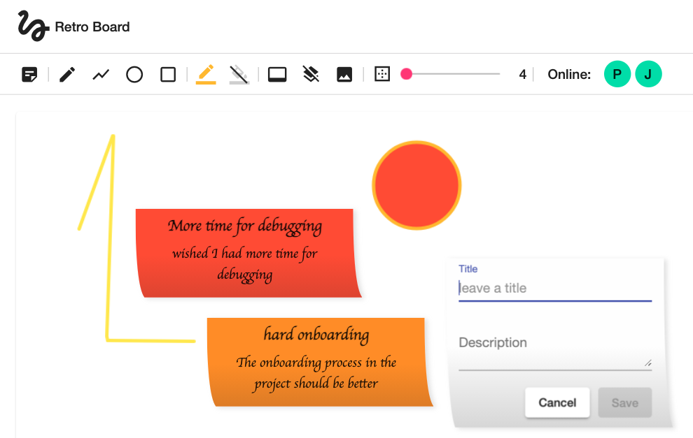

# Retro Board

<a href="https://www.buymeacoffee.com/dkoppenhagen" target="_blank"></a>

[](http://makeapullrequest.com)
[](https://github.com/ellerbrock/open-source-badge/)
[](https://d-koppenhagen.github.io/angular-tag-cloud-module/)

Retro Board is a collaborative drawing / retrospective tool that enables the users to draw collaboratively between their browsers.



The original code base was inspired and forked from [@jeffersonswartz canvas-app](https://github.com/jeffersonswartz/canvas-app)
### Development

Install Angular CLI globally.

```sh
$ npm install -g @angular/cli
```

Install the dependencies and devDependencies.

```sh
$ npm install
```

Adjust the Firebase configuration and connect it to your instance by copying the template and change the content:

```sh
cp src/environments/environment.example.ts src/environments/environment.ts
# open src/environments/environment.ts and adjust the content
```

Start the app locally

```sh
$ npm start
```

That's it. 🎉
